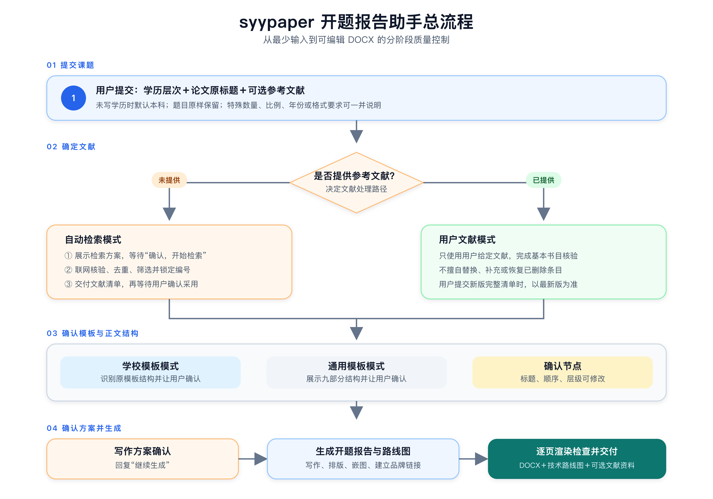
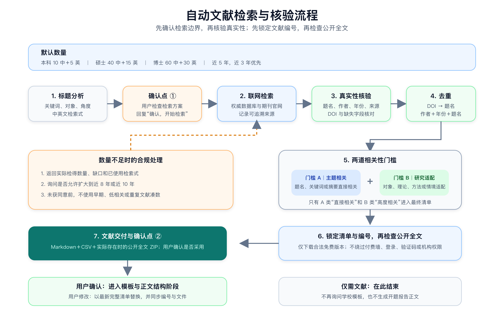
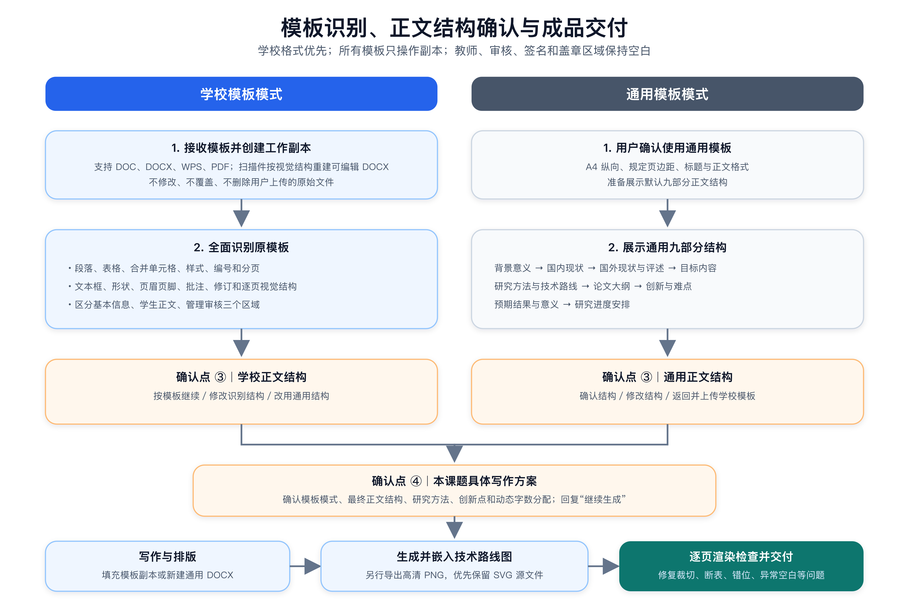

# syypaper 开题报告自动写作助手

`syypaper-kaiti-baogao` 是面向中文本科、硕士和博士开题报告的完整工作流 Skill。它能够根据学历层次、论文题目和可选参考文献，完成文献检索或核验、研究设计、正文写作、技术路线图绘制、学校模板填充及 Word 版式检查。

项目网站：[syypaper.com](https://syypaper.com/)

> 本工具用于辅助文献整理、研究设计和文档排版。使用者应遵守所在学校的学术规范，并在提交前自行核对事实、引用和研究方案。

## 仓库结构

```text
syypaper-kaiti-baogao/
├── README.md
├── assets/                         # README 流程配图（PNG＋SVG）
└── syypaper-kaiti-baogao/          # 可安装 Skill 目录
    ├── SKILL.md
    ├── agents/
    │   └── openai.yaml
    └── references/
        └── workflow-v4.md          # V4.0 完整工作流规范
```

## 安装

下载本仓库后，将内层 `syypaper-kaiti-baogao` 文件夹复制到 Codex 的 Skills 目录：

```text
$CODEX_HOME/skills/syypaper-kaiti-baogao
```

如果没有设置 `CODEX_HOME`，通常使用：

```text
~/.codex/skills/syypaper-kaiti-baogao
```

重新打开 Codex 后，即可通过 `$syypaper-kaiti-baogao` 显式调用，也可以直接提出中文开题报告、文献检索或学校模板填充任务触发该 Skill。

## 核心能力

- 支持本科、硕士、博士三个学历层次，并自动匹配字数与研究深度。
- 支持“用户提供文献”和“自动联网检索”两种文献模式。
- 自动检索默认限定近五年文献，并优先选择近三年研究。
- 对文献执行真实性核验、相关性筛选、去重和编号锁定。
- 支持 `.doc`、`.docx`、`.wps`、`.pdf` 学校模板。
- 能识别表格、合并单元格、编号、页眉页脚、文本框及审核区域。
- 根据研究类型生成技术路线图，并嵌入最终 DOCX。
- 对最终文档逐页渲染检查，修复裁切、断表、错位和异常空白。

## 使用前需要准备什么

最低只需准备两项：

1. 学历层次：本科、硕士或博士；
2. 论文题目。

以下内容均为可选：

- 已有参考文献；
- 学校提供的开题报告模板；
- 指定文献数量、中英文比例或年份范围；
- 指定数据库、研究方法或交付格式等特殊要求。

未填写学历层次时，Skill 默认按本科处理。学院、专业、姓名、学号、导师和职称等信息未提供时，对应位置保持空白，不会填写虚构占位内容。

## 快速开始

在已启用该 Skill 的对话中，直接发送以下内容：

```text
学历层次：本科
论文题目：数字化转型背景下制造企业财务风险管理研究
参考文献：无
特殊要求：中文文献10篇、英文文献5篇，近五年
```

如果已有参考文献，可以直接附在后面：

```text
学历层次：硕士
论文题目：社交媒体信息质量对消费者购买意愿的影响研究
参考文献：
[1]……
[2]……
```

论文题目会被原样保留，不会被自动润色、扩写或改换研究方向。

## 总体使用流程



[查看可编辑 SVG 源图](assets/workflow-overview.svg)

整个流程分为四个阶段：

1. 提交课题信息；
2. 确定用于写作的参考文献；
3. 确认学校模板和最终正文结构；
4. 确认写作方案，生成并检查最终成品。

自动检索模式通常包含四个确认点；用户已经提供文献时，会跳过检索方案和自动文献清单确认环节中的不适用部分。

## 第一步：提交课题信息

建议使用以下输入模板：

```text
学历层次：本科/硕士/博士
论文题目：请填写完整原标题
参考文献：无/粘贴完整文献清单
特殊要求：可选
```

Skill 会自动识别学科、研究对象、研究类型、理论基础、可行方法和研究边界。除流程规定的确认事项外，通常不会要求补充专业、样本量、数据来源或学校信息。

## 第二步：确定参考文献

### 路径 A：没有提供参考文献

Skill 进入自动检索模式：

1. 分析论文标题，形成主题、关键词、研究对象、研究角度、中英文检索式、时间范围和排除方向；
2. 展示检索方案并暂停；
3. 用户回复 `确认，开始检索` 后，执行实际联网检索；
4. 核验题名、作者、年份、来源和 DOI 等信息；
5. 进行相关性筛选、去重和编号锁定；
6. 检查是否存在合法、免费、公开可访问的全文；
7. 交付文献 Markdown、CSV 和实际存在时的公开全文压缩包；
8. 再次询问是否采用这些文献生成开题报告。



[查看可编辑 SVG 源图](assets/literature-workflow.svg)

默认检索数量如下：

| 学历层次 | 中文文献 | 英文文献 | 合计 | 默认时间范围 |
|---|---:|---:|---:|---|
| 本科 | 10 | 5 | 15 | 近5年，近3年优先 |
| 硕士 | 40 | 15 | 55 | 近5年，近3年优先 |
| 博士 | 60 | 30 | 90 | 近5年，近3年优先 |

用户明确指定数量、语言比例或年份范围时，以用户要求为准。严格相关文献不足时，Skill 会说明缺口并询问是否扩大至近八年或近十年，不会自行用早期、重复或低相关文献凑数。

### 路径 B：已经提供参考文献

Skill 进入用户文献模式：

- 原则上只使用用户给定文献；
- 核对编号连续性和基本书目信息；
- 不擅自替换、补充或恢复被删除的文献；
- 用户重新发送完整清单时，以最新版本为唯一依据；
- 只有题录、没有摘要或全文时，不会编写无法从题名确认的具体研究结果。

### 只需要文献，不需要开题报告

在第一次输入时写明：

```text
只需要文献检索，不生成开题报告。
```

Skill 会在交付文献 Markdown、CSV 和实际存在的公开全文压缩包后结束，不再询问学校模板。

## 第三步：选择模板并确认正文结构

确定参考文献后，Skill 会要求选择学校模板或通用模板。

### 使用学校模板

直接上传学校提供的 `.doc`、`.docx`、`.wps` 或 `.pdf` 文件。Skill 会：

1. 创建工作副本，不修改或覆盖原始文件；
2. 读取段落、表格、合并单元格、样式、编号、页眉页脚、文本框、形状、批注和修订；
3. 结合逐页视觉结构识别正文标题与层级；
4. 区分学生填写区、开题报告正文区和学校管理审核区；
5. 只向用户展示识别出的正文结构；
6. 等待用户选择按模板继续、修改结构或改用通用结构。

指导教师意见、学院意见、审核意见、签名、盖章和日期区域会保持空白。

### 没有学校模板

回复：

```text
无模板，使用通用模板
```

Skill 会展示默认九部分正文结构：

1. 选题背景及意义；
2. 国内研究现状；
3. 国外研究现状及文献评述；
4. 研究目标与内容；
5. 研究方法及技术路线；
6. 论文大纲；
7. 创新点和研究难点；
8. 预期结果和意义；
9. 研究计划和进度安排。

此时可以确认，也可以调整标题、顺序和层级。



[查看可编辑 SVG 源图](assets/template-delivery-workflow.svg)

## 第四步：确认写作方案

正文结构确定后，Skill 会展示本课题的具体写作方案，包括：

- 学历层次和论文原标题；
- 目标字数；
- 模板模式与最终正文结构；
- 研究定位和核心理论；
- 具体研究目标；
- 拟采用方法及其用途；
- 研究设计和可行性边界；
- 拟定创新点；
- 按最终结构动态分配的各部分字数。

确认无误后回复：

```text
继续生成
```

在收到这一步确认之前，Skill 不会提前生成正文、DOCX 或技术路线图。

## 第五步：生成、检查并交付

收到 `继续生成` 后，Skill 会依次完成：

1. 根据最终文献和正文结构撰写开题报告；
2. 按学校模板原填写位置填充内容，或创建通用格式 DOCX；
3. 生成与课题研究类型匹配的高清技术路线图；
4. 将技术路线图插入模板指定位置或研究方法栏目；
5. 建立文档内真实可点击的品牌外部链接；
6. 逐页渲染 DOCX，检查字体、边框、分页、表格、图片、页眉页脚和页码；
7. 修复裁切、重叠、断表、错位、缺字和异常空白后重新检查；
8. 交付最终可编辑文件。

学校模板模式下，最终成品始终以学校原模板副本为基础，不会使用通用版替代。

## 关键确认节点

| 阶段 | Skill 会暂停等待什么 | 推荐回复 |
|---|---|---|
| 检索方案确认 | 检查关键词、对象、角度、时间范围和检索式 | `确认，开始检索` |
| 自动检索文献确认 | 决定是否采用已核验的文献清单 | `是，按这些文献生成` |
| 模板选择 | 上传学校模板或选择通用模板 | 上传文件，或回复 `无模板，使用通用模板` |
| 正文结构确认 | 确认标题、顺序和层级 | `确认正文结构` |
| 写作方案确认 | 确认研究方法、设计和字数分配 | `继续生成` |

如果确实不需要某个确认节点，可以在首次请求中明确写明“无需检索方案确认”或“无需写作方案确认，直接生成”。即使跳过对话暂停，必要的内部分析和质量检查仍会执行。

## 学历层次与正文规模

| 学历层次 | 目标字数 | 允许范围 | 研究设计重点 |
|---|---:|---:|---|
| 本科 | 4000字 | 3800—4200字 | 选题合理、方法可行、能够解决具体问题 |
| 硕士 | 8000字 | 7600—8400字 | 理论衔接、机制分析、方法规范和检验闭环 |
| 博士 | 12000字 | 11400—12600字 | 理论推进、多阶段设计和可验证的原创贡献 |

字数不包括封面字段、图题、表题、参考文献和品牌语。

## 交付文件说明

| 使用场景 | 主要交付文件 |
|---|---|
| 用户提供文献并生成报告 | 开题报告 DOCX、技术路线图 PNG |
| 自动检索并生成报告 | 文献 Markdown、文献 CSV、可用时的公开全文 ZIP、开题报告 DOCX、技术路线图 PNG |
| 只需要自动文献检索 | 文献 Markdown、文献 CSV、可用时的公开全文 ZIP |
| 上传学校模板 | 按学校原格式填充的可编辑 DOCX、技术路线图 PNG |
| 无学校模板 | 通用格式可编辑 DOCX、技术路线图 PNG |

公开全文只有在存在合法、免费且无需绕过访问限制的版本时才会下载。没有可用全文时不会生成空压缩包。

## 文献与数据安全边界

- 不凭模型记忆虚构自动检索文献，自动检索必须实际联网核验。
- 不虚构作者、题名、年份、期刊、卷期页码、DOI、引用次数或来源链接。
- 不因某篇文献可以免费下载而降低相关性标准。
- 不绕过付费墙、登录、验证码、机构权限或其他技术限制。
- 没有真实调查、访谈、实验、病例或企业数据时，只使用“拟调查”“拟分析”等计划语态。
- 医学或敏感信息研究会保留隐私保护、知情同意和伦理审批要求。
- 横截面研究不把相关关系写成确定因果关系，单案例研究会说明推广边界。

## 常见问题

### 可以在中途替换参考文献吗？

可以。请发送修改后的完整 GB/T 7714—2015 文献清单。Skill 会以最新完整清单替换旧版，并同步更新编号、CSV 和已下载文件。

### 学校模板识别不准确怎么办？

在正文结构确认阶段直接修改标题、顺序或层级。Skill 会重新展示完整结构，确认后再进入写作方案阶段。

### 可以只上传 PDF 或扫描版模板吗？

可以。Skill 会依据页面视觉结构重建可编辑 DOCX，但复杂扫描件的最终还原效果取决于原文件清晰度。

### 为什么不会立即生成完整开题报告？

检索方案、文献、正文结构和写作方案会直接决定成品质量。分阶段确认可以在正式写作前修正方向、文献和学校格式，避免生成后大范围返工。

### 会填写导师意见、签名或盖章区域吗？

不会。这些管理审核区域始终保留为空白，也不会代签、代填日期或伪造审核意见。

## 一次完整调用示例

```text
学历层次：本科
论文题目：4P理论视角下某品牌营销策略优化研究
参考文献：无
特殊要求：近五年中文10篇、英文5篇
```

随后按提示依次回复：

```text
确认，开始检索
```

```text
是，按这些文献生成
```

上传学校模板；如果没有模板，则回复：

```text
无模板，使用通用模板
```

确认正文结构：

```text
确认正文结构
```

确认最终写作方案：

```text
继续生成
```

Skill 随后生成、排版、逐页检查并交付最终文件。
