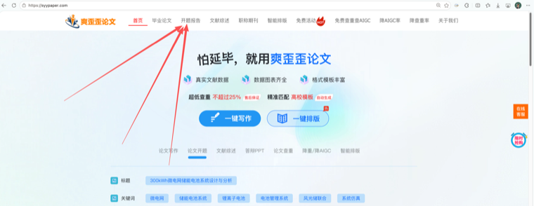
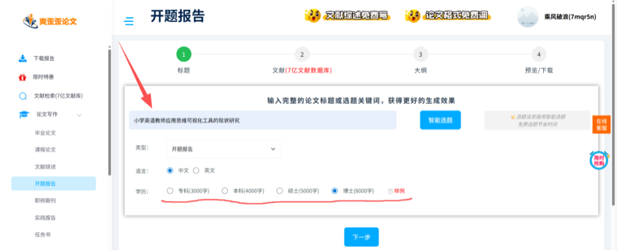
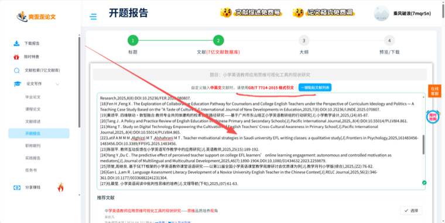
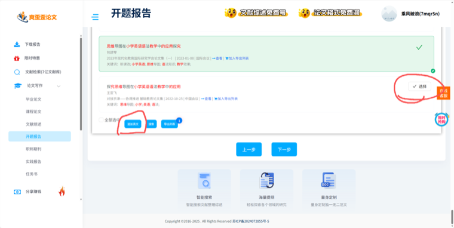
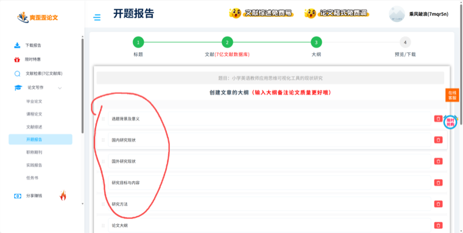
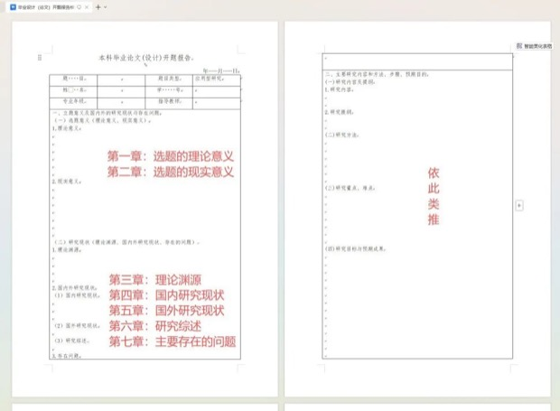
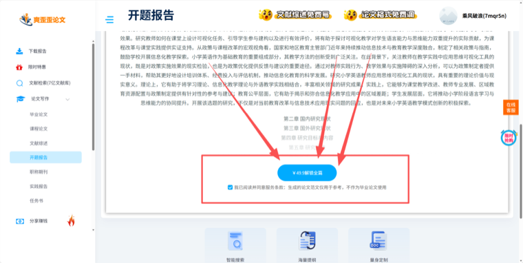
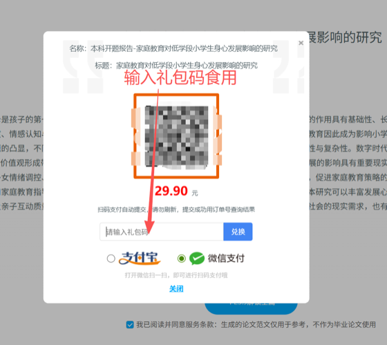

# syypaper 开题报告礼包码使用指南

[返回项目主页](../README.md)

先领取免费礼包码，再完成开题报告生成、预览与兑换。

## 目录

- [0. 先领取免费礼包码](#0-先领取免费礼包码)
- [开始前准备](#开始前准备)
- [1. 进入官网并登录](#1-进入官网并登录)
- [2. 填写选题并选择生成规格](#2-填写选题并选择生成规格)
- [3. 添加并核验参考文献](#3-添加并核验参考文献)
- [4. 按学校要求调整大纲](#4-按学校要求调整大纲)
- [5. 预览结果并进入解锁页面](#5-预览结果并进入解锁页面)
- [6. 输入礼包码并完成兑换](#6-输入礼包码并完成兑换)
- [常见问题](#常见问题)

## 0. 先领取免费礼包码

### 方式：扫码咨询领取

扫描企业微信二维码，咨询领取开题报告免费礼包码。


```text
领取完成后：复制礼包码 → 暂存到记事本 → 在步骤 6 的解锁弹窗中粘贴
```

---

## 开始前准备

> [!IMPORTANT]
> **进入 SYYPAPER 前，请先断开 VPN、代理、网络加速器等特殊网络环境，否则页面可能出现加载缓慢或卡顿。请勿断开正常互联网连接。**

- [ ] 使用电脑端 Microsoft Edge 或 Google Chrome。
- [ ] 已关闭 VPN、代理或网络加速器，并保留正常互联网连接。
- [ ] 准备确定的论文选题。
- [ ] 准备学校要求的开题报告大纲或模板。
- [ ] 准备可核验的参考文献。
- [ ] 已领取并复制保存免费礼包码。

## 1. 进入官网并登录

在浏览器地址栏直接打开：

```text
https://www.syypaper.com
```

进入首页后，点击顶部导航栏中的“开题报告”；若尚未登录，点击右上角头像区域并扫码登录。

> [!WARNING]
> 请确认域名为 `www.syypaper.com`。不要把网址输入搜索框后再从搜索结果中寻找。



## 2. 填写选题并选择生成规格

输入完整、明确的论文题目，确认类型为“开题报告”，选择中文或英文，并按实际学历选择对应字数。



## 3. 添加并核验参考文献

可以自行上传【查新引文】格式引文，也可以使用系统推荐文献。

### 方式 A：自行上传文献

将文献整理为【查新引文】引文格式后粘贴到输入框。系统会根据报告篇幅尽可能引用，上传过多可能导致生成失败。

> [!NOTE]
> 建议数量：本科不超过 20 篇；硕士不超过 40 篇；博士不超过 60 篇。



### 方式 B：使用推荐文献

优先选择近 3—5 年、可在知网等来源核验的文献；需要英文文献时可点击“追加英文”。

建议逐篇点击“查看”核验原文，并保存原文链接。若“查看”暂不可用，可复制标题后自行检索核验。



## 4. 按学校要求调整大纲

将系统大纲替换为学校要求的大纲，并检查章节顺序、研究内容和研究方法是否完整。

> [!CAUTION]
> 若学校模板包含二级标题，需要先将这些二级标题提升为一级标题再生成。请保留“国内研究现状”和“国外研究现状”，否则可能缺少文献上标引用。



学校模板层级调整示例：



## 5. 预览结果并进入解锁页面

在预览页面快速检查题目、章节结构、研究现状、引用和参考文献是否符合要求。确认无明显问题后，勾选服务条款并点击“解锁全篇”。



> [!TIP]
> 找不到礼包码入口时，先确认使用的是电脑浏览器，再按 `Ctrl` + `-`，或按住 `Ctrl` 向下滚动鼠标滚轮，将页面缩小到约 80%—90%。

### 兑换前检查

- [ ] 题目、学历和报告字数选择正确。
- [ ] 文献真实可查，且数量未明显超出建议范围。
- [ ] 大纲层级已按学校模板调整，并保留国内、国外研究现状。
- [ ] 预览内容无明显缺段、错题或异常重复。

## 6. 输入礼包码并完成兑换

在付款弹窗中找到“请输入礼包码”输入框，粘贴礼包码后点击“兑换”。兑换成功后，按页面提示查看或下载完整报告。

```text
解锁全篇 → 请输入礼包码 → 粘贴 → 兑换
```



> [!NOTE]
> 兑换失败时，先检查礼包码是否完整、前后是否有多余空格、是否已使用或过期。

## 常见问题

| 问题 | 处理方法 |
| --- | --- |
| 官网打不开 | 确认在地址栏输入 `https://www.syypaper.com`，并更换 Edge 或 Chrome 重试。 |
| 生成时报错 | 减少上传文献数量，检查引文格式，然后重新生成。 |
| 引用上标缺失 | 检查大纲是否保留“国内研究现状”和“国外研究现状”。 |
| 看不到礼包码入口 | 使用电脑浏览器，并把页面缩放至约 80%—90%。 |
| 兑换失败 | 去除礼包码前后空格，确认未过期、未使用，再联系客服。 |

> [!TIP]
> **完成标准：** 成功兑换礼包码，并看到完整报告的查看或下载入口。
